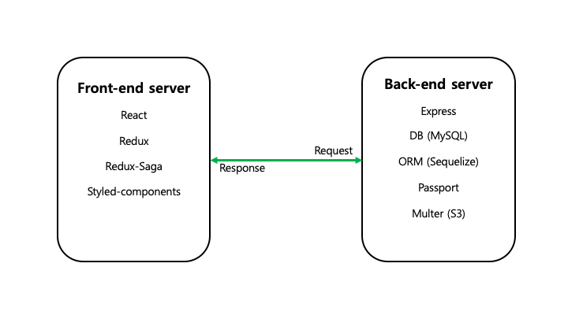

# dear-sns


100% inspired by Twitter, fundamental SNS features developed by Next.js

[Demo](http://dear-sns.club)  

*****
## At a glance


### Why divided into front-end / back-end 'server' ? 🤷🏻‍♀️🤷🏼‍♂️

Because the rolls are different🍴  
Front is to transmit mainly HTML/CSS and JS files.  
On the other hand, Back is to store and handle data from Front accordingly.  

## Getting started

### DB configuration

Before we start, please check [Sequelize's documentation](http://docs.sequelizejs.com/manual/migrations.html)   

As mentioned in the document, edit **config/config.json** as yours       
it should look like down below:

```sh
{
  "development": {
    "username": "Your DB username",
    "password": "Your DB password",
    "database": "database_development",
    "host": "127.0.0.1",
    "dialect": "mysql"
  },
                .
                .
                .
}

```


