# dear-sns


[](https://travis-ci.org/dwyl/esta)

100% inspired by Twitter, fundamental SNS features developed by Next.js


*****
## At a glance


### Why divided into front-end / back-end 'server' ? 🤷🏻‍♀️🤷🏼‍♂️

Because the rolls are different.🍴  
Front is to transmit mainly HTML/CSS and JS files.  
On the other hand, Back is to store and handle data from Front accordingly.  

## Getting started

### DB configuration

Before we start, please check [Sequelize's documentation](http://docs.sequelizejs.com/manual/migrations.html)   

As mentioned in the document, edit `config/config.json` file as yours       
It should look like down below:

```sh
{
  "development": {
    "username": "Your DB username",
    "password": "Your DB password",
    "database": "database_development",
    "host": "127.0.0.1",
    "dialect": "mysql"
  },
                .
                .
                .
}

```

### ERD
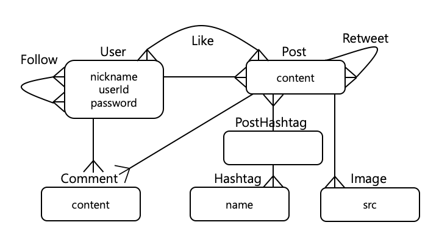

### Association

A user can make many posts and comments; one-to-many => `hasMany`   
Little tricky thing here is generally a hashtag can have many posts. Let's imagine #love on Instagram
likewise, a post so in this case, we set both like below so      
`db.Post.belongsToMany(db.Hashtag, { through: 'PostHashtag' };`   
`db.Hashtag.belongsToMany(db.Post, { through: 'PostHashtag' });`   
Due to 'belongsToMany' association, we need to use `through` attribute to create new model `PostHashtag`   
You can also look up these associations [Sequelize's documentation](http://docs.sequelizejs.com/class/lib/associations/base.js~Association.html)


## AWS

As we discussed, let's create two instances - front and back

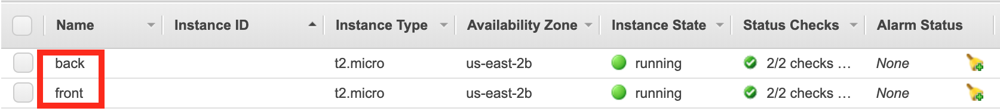

In the process to launch an instance, if you have reached ***Step 6: Configure Security Group***   
Please add rules HTTP and HTTPS so that we can access it front side

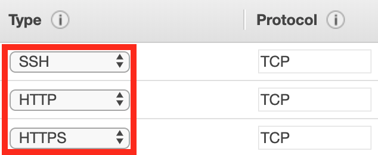

### Installing Node & MySQL

Before installing Node on your Ubuntu or Amazon Linux whatever you have chosen, we should kindly update it as the newest version
```sh
apt-get update
```

We also need to install vim or nano depending on what text editor you would like
```sh
apt-get intall vim
```

then, please install down below for essential thigs
```sh
apt-get install -y build essential
```

We use Node 10.x version
```sh
curl -sL https://deb.nodesource.com/setup_10.x | sudo -E bash --
```

Once you have finished installation above, now we finally install Node
```sh
apt-get install -y nodejs
```

Now remember, as we have two servers, we need to do it for back-end server as well   
Plus, we should install MySQL ***only for back-end server***
```sh
apt-get install -y mysql-server
```
```
mysql_secure_installation
```

### Cloning this repository

```sh
git clone https://github.com/footlessbird/react-sns.git
```

After cloning, let's move to `/front` directory and make sure that we got both Node and NPM successfully installed
```sh
node -v
npm -v
```
after that commands if you see versions like so `10.16.0`, `6.9.0` then we are good to go

install all the dependencies
```sh
npm i
```

Exactly same for back-end but move to `/back` directory


### NPM build and start

Before running server we need build it first
```sh
npm run build
```
now we can do below to run
```
npm start
```

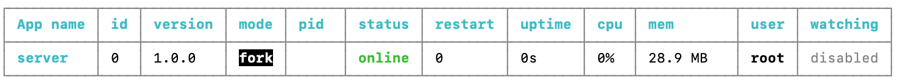
If you see it, it's running in background


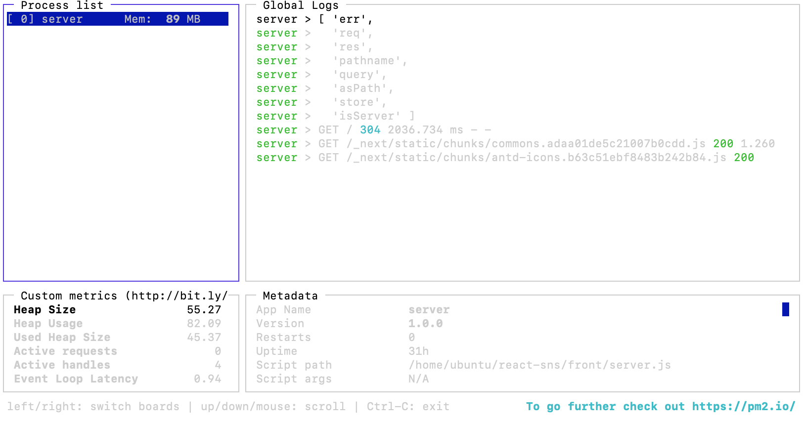
We can also check logs
```sh
pm2 monit
```
See more detail please check [PM2](http://pm2.keymetrics.io/docs/usage/pm2-doc-single-page/)

Same thing for back-end this time as well👯‍♀️

### MySQL error handling

If you face error showing by pm2 monit in back-end server   
***Client does not support authentication protocol requested by server...***   

Check [here](https://stackoverflow.com/questions/50093144/mysql-8-0-client-does-not-support-authentication-protocol-requested-by-server)


### Sequelize setting
Let's move to back-end server `/back` and install below
```sh
npm i -g sequelize-cli
```

```sh
sequelize db:create
```
If you see `Database name_of_database created.`, we are good to go and please kindly restart the server

```sh
pm2 reload all && pm2 monit
```
You can restart server and monitor at the same time by doing so

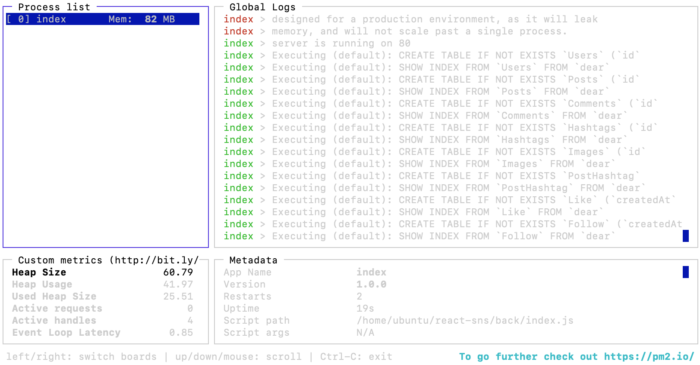
Let's check DB tables have been succussfully created

## Applying domain

To use custom domain, you might want buy one from one of domain sellers such as Namecheap, GoDaddy and many more   

### Route 53
Let's go to one of AWS services called ***Route 53***

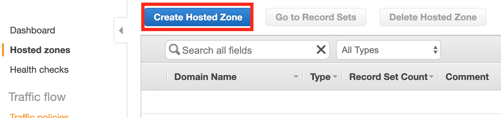
Click `Create Hosted Zone`   

Enter your domain in the `Domain Name:` box
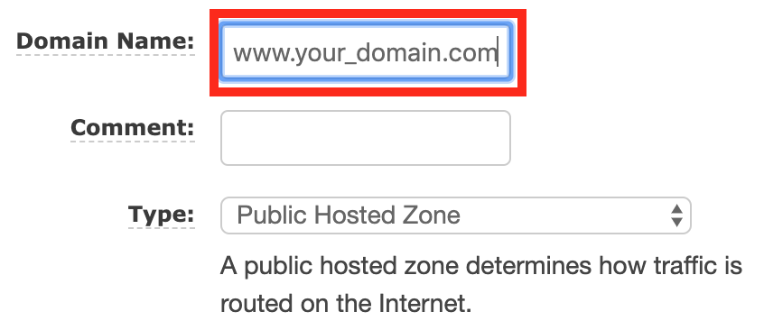

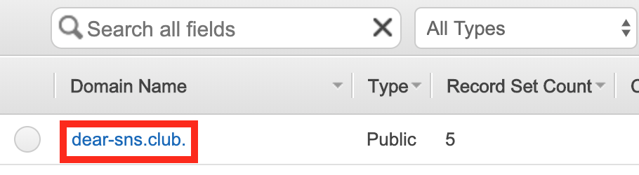
You'll see your domain appeared, click your domain   

Domain where you have bought might have manage-option for your domain and there might be nameservers   
Please kindly replace them with things in the red box in the picture below

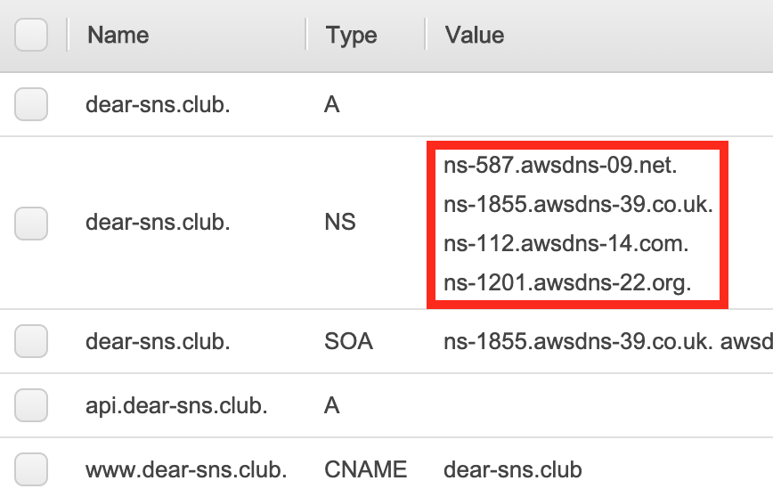

Same page, in the picture above, there is `Create Record Set`   
Click it then you'll see the picture below

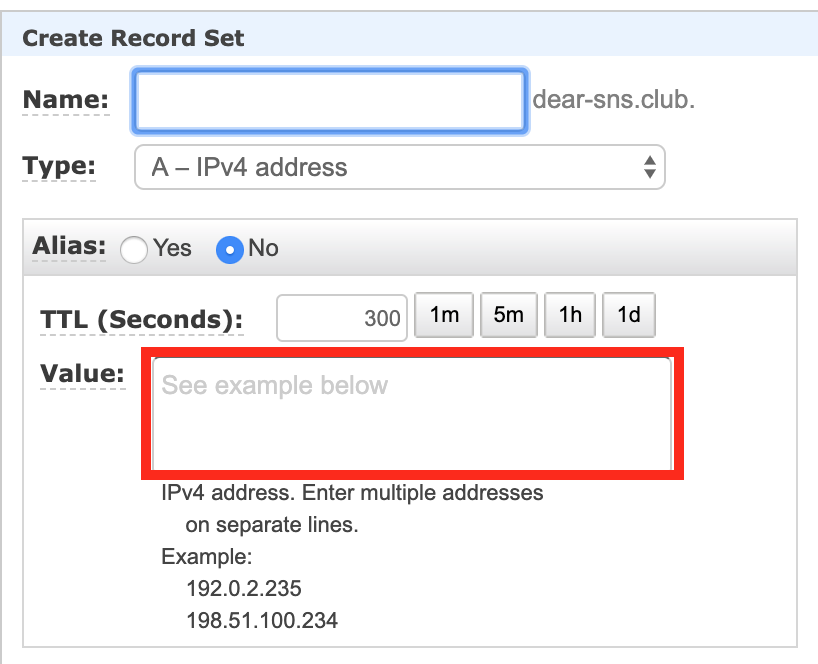

In the red box, please enter your front-end server's public IP (IPv4 Public IP)   

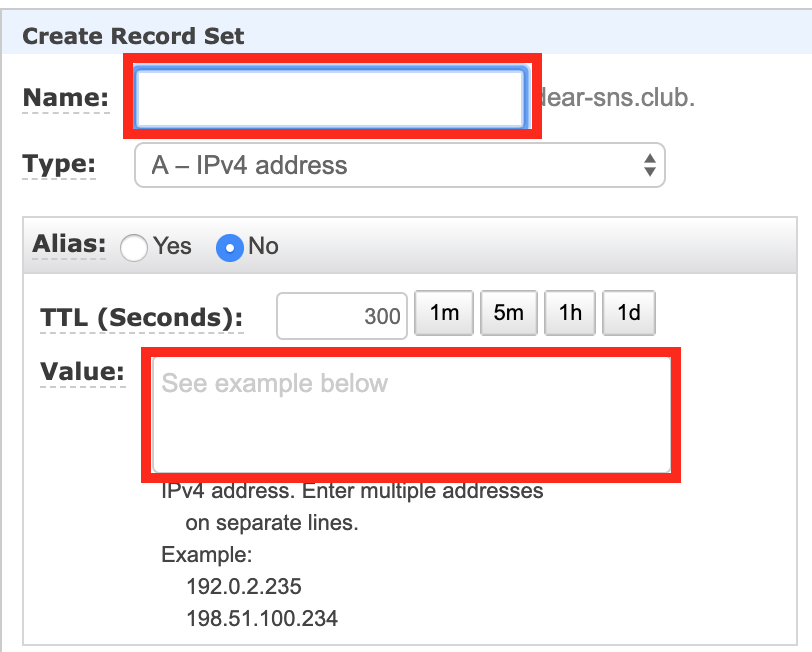

Same thing for back-end server but back-end server's public IP (IPv4 Public IP) and very first red box `Name:` enter `api`   

If you want to use `www` like prefix for your domain `www.your-domain.com` `Name:` enter `www` change `Type:` to `CNAME - Canocial name` and `Value:` enter your domain like `your-domain.com` 

To sum up so for, you should be albe to access your front-end `your-domain.com` and back-end `api.your-domain.com`

### Inserting your domain

It's time to apply your domain   

Remember we just have made back-end server domain `api.your-domain.com` like so   


In `/front/config/config.js`   

change the domain to yours

```sh
const backUrl = process.env.NODE_ENV === 'production' ? 'http://api.your-domain.com' : 'http://localhost:3065'

```

In `/pages/post.js`
```sh
<Helmet
        title={`${singlePost.User.nickname}`}
        description={singlePost.content}
        meta={[{
          name: 'description', content: singlePost.content,
        }, {
          property: 'og:title', content: `${singlePost.User.nickname}`,
        }, {
          property: 'og:description', content: singlePost.content,
        }, {
          property: 'og:image', content: singlePost.Images[0] && singlePost.Images[0].src,
        }, {
          property: 'og:url', content: `http://your-domain.com/post/${id}`,
        }]}
      />
```


### S3

In order to secure data, there might be some issues storing data in servers   
When servers duplicated it'll end up having duplicated data as well and if severs are removed, the data will be removed too so we seperate data by using [S3](https://docs.aws.amazon.com/AmazonS3/latest/dev/Welcome.html)


Let's go to AWS S3, then create bucket

In `/back/routes/post.js` you need to type your bucket name like below so

```sh
const upload = multer({
  storage: multerS3({
    s3: new AWS.S3(),
    bucket: 'your-bucket-name',
    key(req, file, cb) {
      cb(null, `original/${+new Date()}${path.basename(file.originalname)}`);
    },
  }),
  limits: { fileSize: 20 * 1024 * 1024 },
});
```

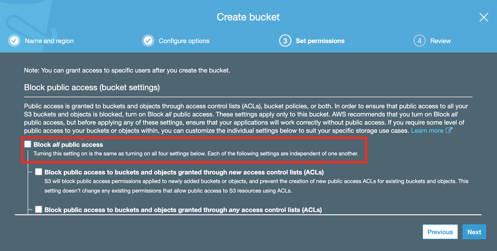

Make sure, uncheck `Block all public access`   

In terms of your taste and various setting methologies of it, it's up to you to make block-options here   


Now we need to get `access key`
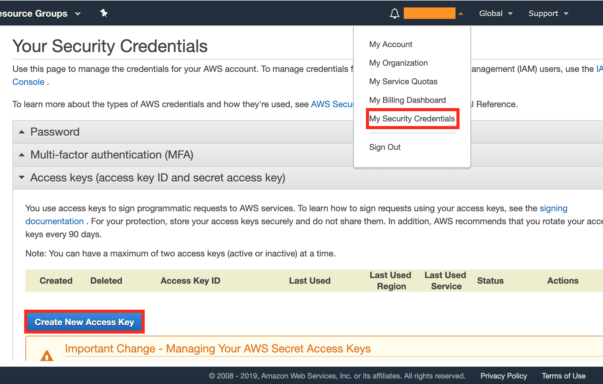

The orange box at the top will be your AWS account ID, click it and go to `My Security Credentials`   
and click the `Create New Access Key` button and download key file, it will be `.csv` file format   
For the security reason, we try not to show it to others  
Use [.env](https://github.com/motdotla/dotenv) to secure it and don't forget to add `.env` to `gitignore`

```sh
AWS.config.update({
  region: 'region you have selected',
  accessKeyId: process.env.S3_ACCESS_KEY_ID,
  secretAccessKey: process.env.S3_SECRET_ACCESS_KEY
})

```

We are almost done for S3 setting go to `Permission` tab and click `Bucket Polocy` button


We need to set Bucket Policy, before we go, please check [here](https://docs.aws.amazon.com/AmazonS3/latest/dev/example-bucket-policies.html)

I set like below so

```sh
{
    "Version": "2012-10-17",
    "Statement": [
        {
            "Sid": "AddPerm",
            "Effect": "Allow",
            "Principal": "*",
            "Action": [
                "s3:GetObject*",
                "s3:PutObject*"
            ],
            "Resource": "arn:aws:s3:::YOUR_BUCKET_NAME/*"
        }
    ]
}
```

Try to upload some images and check your bucket `original` folder

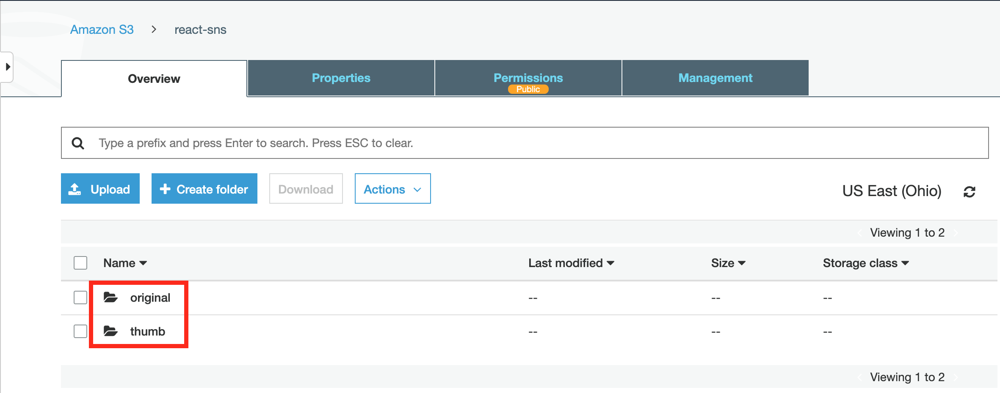

Inside the `original` folder, you should see some images you'have uploaded

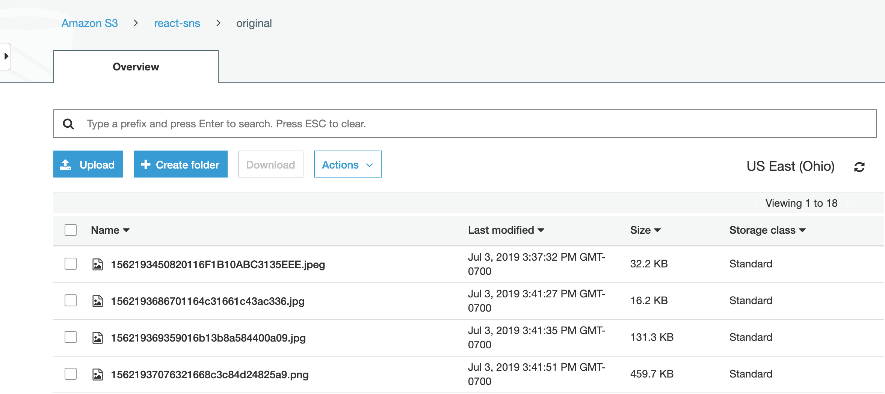


### Cookie setting
In `/back/index.js` 

```sh
app.use(expressSession({
  resave: false,
  saveUninitialized: false,
  secret: process.env.COOKIE_SECRET,
  cookie: {
    httpOnly: true,
    secure: false, // https를 쓸 때 true
    domain: prod && '.your-domain.com'
  },
              .
              .
              .
}));

```
***You must have `.` as prefix of your domain***

### Lambda

[Lambda documentation](https://docs.aws.amazon.com/lambda/index.html)

For this app, we use Lambda for resizing images   

Firstly, we install Claudia to easily use Lambda, regardless of OS   

In back-end server `/back`
```sh
npm i -g claudia
```

move to home directory of your back-end server by typing => `cd ~`

```sh
// make .aws folder
mkdir .aws
// move to .aws folder
cd .aws
// make credentials file
vim credentials
```
In `credentials file`, you need to type `aws access key ID and secret key`, one you got `.csv` file like below so

```sh
[default]
aws_access_key_id=YOUR_ACCESS_KEY_ID
aws_secret_access_key=YOUR_SECRET_ACCESS_KEY
```

Let's finish up Lambda setting   
Go to `/lambda` folder type command below

```sh
// type region you have selected, I'm gonna show it as I did 
claudia create --region --region us-east-2 --handler index.handler
```
If you face error regarding permission use `sudo` command like below so

```sh
sudo claudia create --region --region us-east-2 --handler index.handler
```

Now move to AWS Lambda and check, you should be able to see like below


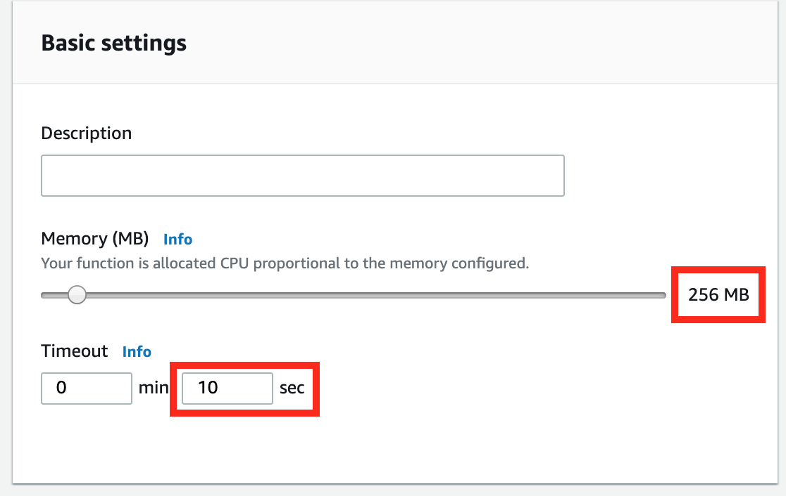
I set Memory `256MB` Timeout as `10sec`


Click `+ Add trigger` and select `S3` and the drop-down menu `Bucket` select your bucket   
for `Prefix`, we enter `original/` then click `ADD` button

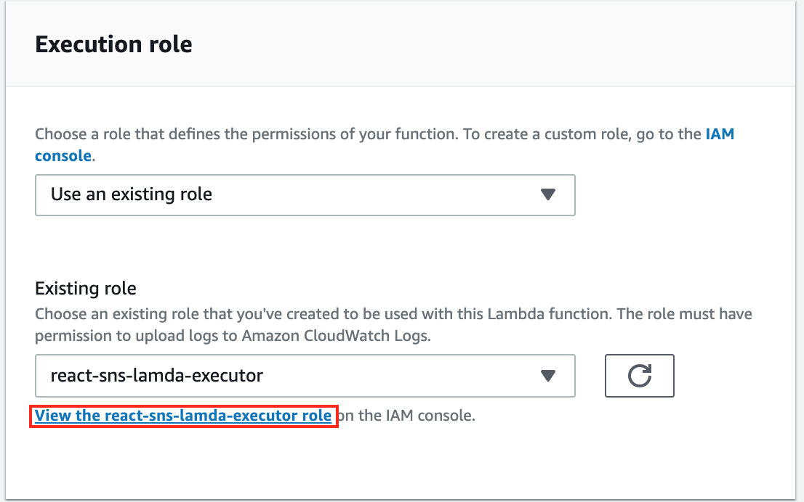
Click the red box area then click `Attach policies` then you'll have a search box   
Type `s3` and set as you want

Now you should be able to see like this
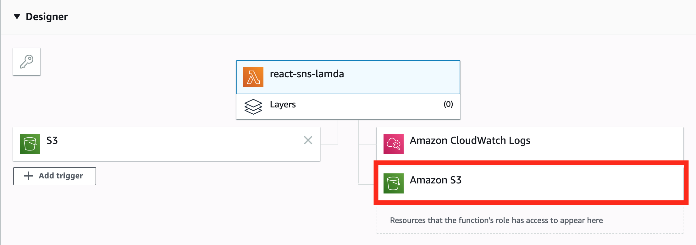

Please check `Monitoring` and `View logs in CloudWatch` to make sure your images resized working as it's expected
*****
